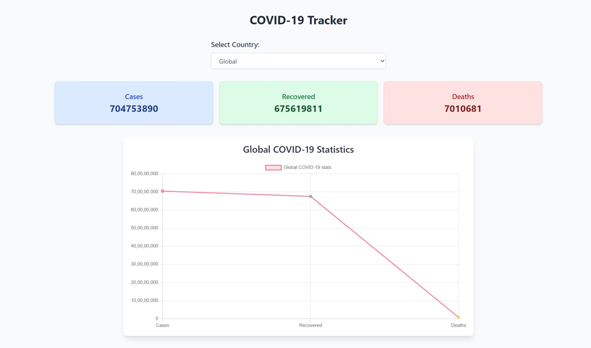

# 🌍 COVID-19 Tracker

This project is a **COVID-19 Tracker** built using **React**, **TailwindCSS**, and **Chart.js**, which provides real-time global and country-specific COVID-19 data. It features a responsive UI with data visualization for better insights.



## Features

- 🌐 **Global & Country-specific Data**: Track COVID-19 statistics like cases, recovered, and deaths globally or by selecting any country.
- 📊 **Interactive Charts**: Visualize COVID-19 data using interactive line charts powered by **Chart.js**.
- 🌍 **Country Picker**: Choose from a wide range of countries to see localized COVID-19 data.
- 📱 **Fully Responsive**: The tracker works seamlessly across mobile, tablet, and desktop devices.
- 🎨 **TailwindCSS** for a clean and modern UI.

## Tech Stack

- **React**: JavaScript library for building user interfaces.
- **TailwindCSS**: Utility-first CSS framework for custom styling.
- **Chart.js**: Visualization library for rendering the COVID-19 statistics in charts.
- **Disease.sh API**: Provides real-time COVID-19 data.

## 🚀 Live Demo

Check out the live demo: [COVID-19 Tracker Live](https://nathsagar96.github.io/covid-tracker)

## 🛠️ Installation & Setup

Follow these steps to set up the project locally:

1. **Clone the repository:**

   ```bash
   git clone https://github.com/nathsagar96/covid-tracker.git
   cd covid-tracker
   ```

2. **Install dependencies:**

   Ensure all required dependencies are installed by running:

   ```bash
   npm install
   ```

3. **Start the development server:**

   Once installed, you can run the app locally:

   ```bash
   npm start
   ```

   The app should now be running on `http://localhost:3000`.

## 🛠️ API Integration

This tracker fetches real-time data from the **Disease.sh** COVID-19 API:

- **Global Data**: `https://disease.sh/v3/covid-19/all`
- **Country Data**: `https://disease.sh/v3/covid-19/countries/{country}`

## 🎨 TailwindCSS Setup

Ensure you have **TailwindCSS** configured in your project by adding the following to your `tailwind.config.js` file:

```js
module.exports = {
  purge: ['./src/**/*.{js,jsx,ts,tsx}', './public/index.html'],
  darkMode: false, // or 'media' or 'class'
  theme: {
    extend: {},
  },
  variants: {
    extend: {},
  },
  plugins: [],
};
```

## 📂 Project Structure

Here's an overview of the project's folder structure:

```text
├── public
├── src
│   ├── api
│   │   └── api.js           # API calls for fetching COVID-19 data
│   ├── components
│   │   ├── CountryPicker.js  # Country selector component
│   │   ├── Statistics.js     # Displays COVID statistics (cases, recovered, deaths)
│   │   └── Chart.js          # Chart visualization component
│   ├── App.js                # Main app structure
│   └── index.js              # Entry point
├── tailwind.config.js
├── package.json
└── README.md
```

## 🤝 Contributing

Contributions are welcome! If you'd like to contribute, please follow these steps:

1. Fork the repository.
2. Create a new branch (`git checkout -b feature-branch`).
3. Make your changes.
4. Push to your branch (`git push origin feature-branch`).
5. Submit a pull request.

## 📝 License

This project is licensed under the **MIT License**. See the [LICENSE](LICENSE) file for details.

---

## 📧 Contact

Feel free to reach out if you have any questions or suggestions:

- GitHub: [@nathsagar96](https://github.com/nathsagar96)
- Email: [nathsagar96@gmail.com](mailto:nathsagar96@gmail.com)

---

## 🌟 Acknowledgements

- **Disease.sh API** for providing real-time COVID-19 data.
- **React.js** and **TailwindCSS** communities for their extensive documentation and support.
- **ChatGPT** for providing guidance and suggestions for improvement.
